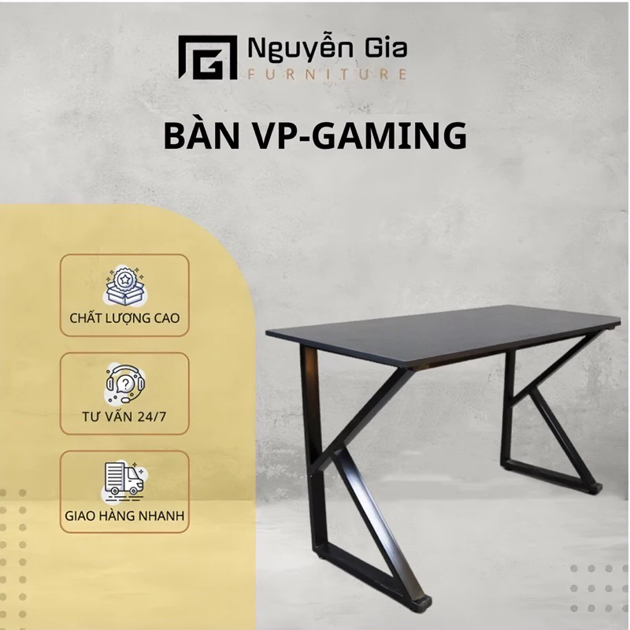

# 🖥️ Góc Setup – E-commerce Website for Desk Setup Accessories

**Góc Setup** is an e-commerce platform that allows users to discover and shop for desk setup accessories — including mechanical keyboards, monitor arms, RGB lighting, and other workspace enhancement tools.

## 🚀 Key Features

- 🔐 **Google Login via OAuth 2.0** – Users can securely log in using their Google account.
- 🛒 **Online Shopping System** – Browse products, add to cart, and place orders seamlessly.
- 📦 **Order Management** – Track order history and status after placing an order.
- 🔍 **Product Search & Filtering** – Easily search by product name, category, brand, or price range.
- 👨‍💼 **Admin Dashboard** – Admins can manage users, products, and orders efficiently.

## 🛠️ Tech Stack

### Frontend:
- EJS (Embedded JavaScript Templates)
- HTML, CSS

### Backend:
- Node.js + Express.js
- PostgreSQL (relational database)
- Multer (for uploading product images)
- OAuth 2.0 (Google Login)
- Nodemailer (for sending order confirmation emails)

## ⚠️ Limitations

- ❌ **Not yet structured using the MVC (Model - View - Controller) architecture**  
> Currently, route handling, database logic, and views are coupled together, which may reduce maintainability and scalability.  
> ✅ *Refactoring to adopt the MVC pattern is planned for future versions.*

## 📷 Screenshots

> Add interface screenshots here: homepage, cart, login with Google, admin panel, etc.
> 

